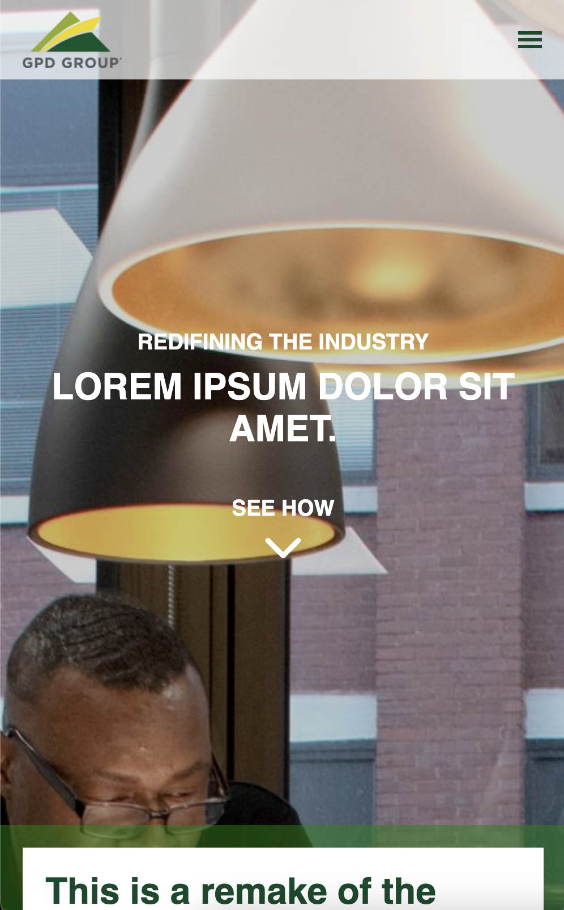

See the site here: https://aflo7.github.io/landing-page-gpd-group/

I used React, Javascript, HTML, and CSS for this project.

I also used github actions so that when you change the code and push to github, the deployed page updates automatically.

Desktop screenshot:

Mobile Screenshot:

